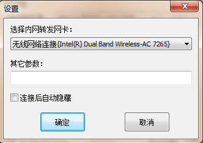

# N2N GUI for Windows

软件介绍：
-
本软件用于为N2N提供Windows的界面操作，包含edge和supernode, 支持添加路由表操作，支持内网穿透。  
也可配合openwrt中的N2N，实现内网穿透。  
本软件直接借用网络上编译好的edge和supernode可执行文件(V2.8)，在此表示感谢。  

使用方法：  
-
首先安装VC2010 X86运行库.  
在Release中下载n2n_gui.rar及n2n_client.rar，解压到同一目录下。  
  
运行 n2n_gui.exe，添加服务器，设置网络信息，点击启动。  
  
要实现内网穿透的功能，请在设置里选择数据转发网卡，配合路由表即可实现。只支持对单一网卡实现穿透。  
  

编译器：  
-
VC2010  
编译时如果要调试，解压n2n_client.rar 到 n2n_gui 文件夹下。

友情提醒：
-
N2N 网络密码在配置文件中未加密，请注意风险

其它：
-
本软件开源并可以免费使用，但只接受Bug反馈。
另外，可提供收费的技术支持，及收费的个性定制。如需服务，邮件联系：dwj00@163.com